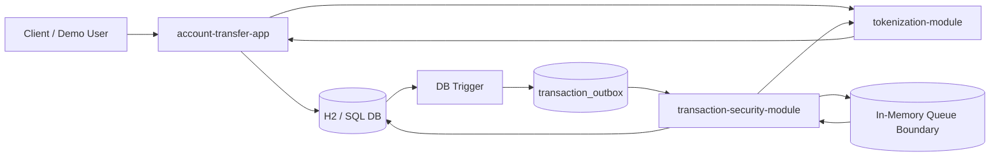
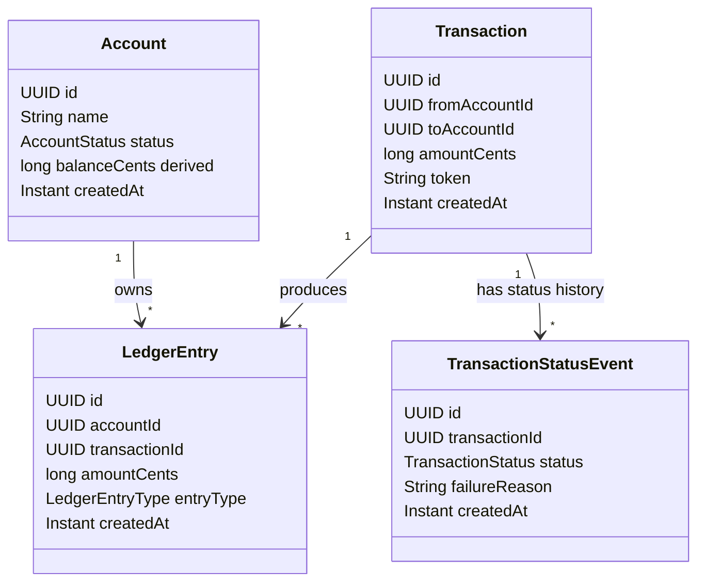
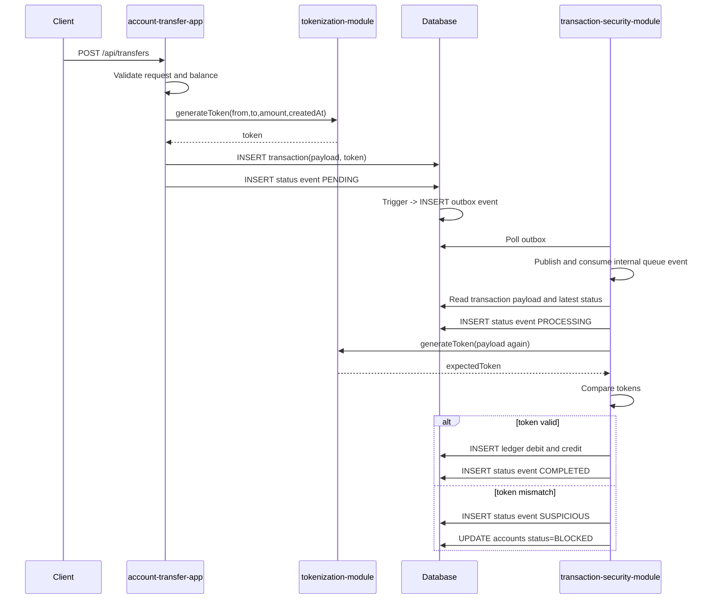
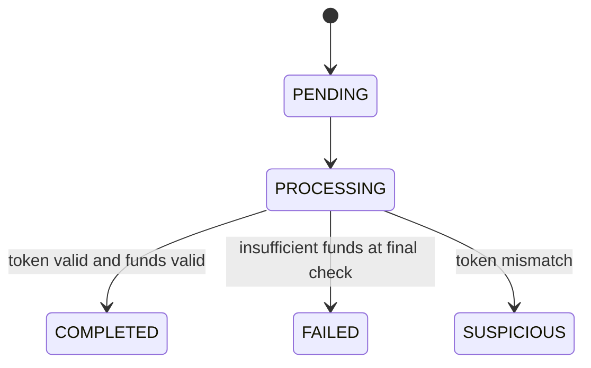

# Secure Transfer Demo Presentation Pack

## 1) Elevator Pitch

This demo presents a secure account-to-account transfer flow with deterministic transaction integrity validation.

The core idea: the original transfer payload is stored as an immutable fact, while processing status is recorded as a separate event history.

## 2) Problem Addressed

Payment-like systems must handle several risks:

1. transaction data tampering after the initial write,
2. unsafe balance updates,
3. weak auditability of status changes,
4. unclear ownership boundaries between application logic and security validation.

The demo addresses these risks with:

1. ledger-derived balances,
2. HMAC token integrity checks,
3. append-only transaction payloads,
4. immutable status events,
5. outbox-driven asynchronous validation.

The implementation is packaged as one runnable demo project. The intended production architecture is a set of separately deployed services with the same boundaries.

## 3) High-Level Architecture

Narration:

1. The main app accepts a transfer request.
2. The tokenization module generates an HMAC token over the canonical transaction payload.
3. The main app inserts the append-only transaction row with the token.
4. A database trigger emits an outbox event after transaction insertion.
5. The security module consumes the event, recomputes the token, and compares both values.
6. A valid transaction produces ledger entries and a `COMPLETED` status event.
7. A token mismatch produces a `SUSPICIOUS` status event and blocks both accounts.

Production framing:

1. `account-transfer-app`, `tokenization-module`, and `transaction-security-module` represent service boundaries.
2. In production, these boundaries become independent cloud services.
3. The in-memory queue is replaced by a broker such as ActiveMQ, RabbitMQ, or Kafka.
4. Each service can scale, deploy, and own secrets independently.

## 4) Domain Model

## 5) Transfer Sequence

## 6) Transaction State Model

Each transition is appended to `transaction_status_events`. The original `transactions` row remains unchanged.

## 7) Security Story

1. Every transfer receives a unique integrity fingerprint: an HMAC token.
2. The token is generated from stable transaction facts: transaction id, source account, target account, amount, and creation timestamp.
3. Before money movement is finalized, the security module recomputes the token from the stored payload.
4. If critical transaction data changes, the recomputed token no longer matches.
5. A mismatch blocks both accounts and records a suspicious status event.

## 8) Demo Script

1. Show the architecture diagram and explain the three modules.
2. Create two accounts (`Alice`, `Bob`) through the API.
3. Create a transfer from Alice to Bob.
4. Show the append-only `transactions` row and initial `PENDING` status event.
5. Wait for asynchronous validation.
6. Show the latest transaction status as `COMPLETED`.
7. Show ledger-derived balances.
8. Explain the mismatch path: `SUSPICIOUS` status event plus account blocking.

## 9) Why This Design Is Minimal but Correct

1. Authentication is intentionally out of scope for the demo.
2. Money correctness is represented through immutable ledger entries.
3. Transaction integrity is deterministic because the token is an HMAC over canonical fields.
4. Status changes are auditable because they are appended as events.
5. The outbox pattern demonstrates a production-style asynchronous boundary without requiring a broker installation.

## 10) Production Target

The demo maps to three production services:

1. `account-transfer-service` for API and transfer orchestration.
2. `tokenization-service` for HMAC token generation and secret isolation.
3. `transaction-security-service` for asynchronous validation and incident handling.

The services should normally be deployed independently in cloud infrastructure. Separate repositories are recommended when teams, release cycles, and security ownership differ.

Event processing should use an external broker:

1. ActiveMQ or RabbitMQ for standard queued validation workloads.
2. Kafka for high-throughput streams, replay, and larger event-processing requirements.

The broker allows the security service to process validation events at its available capacity without blocking transaction creation.

## 11) FAQ

Q: Why is there no `amount` field on the account table?  
A: Balance is derived from immutable ledger entries, not stored as a mutable account field.

Q: Why is `transactions` append-only?  
A: The original transfer payload must remain auditable. Status changes belong in `transaction_status_events`.

Q: Is this already microservices?  
A: The current implementation is a modular monolith for demo convenience. The target architecture is separate deployable services.

Q: What is the next step toward production?  
A: Separate service deployments, external broker, service-level authentication, secret management, idempotency, observability, and database role separation.
