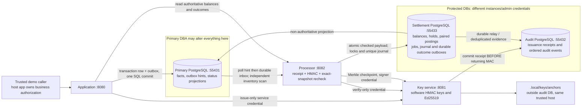
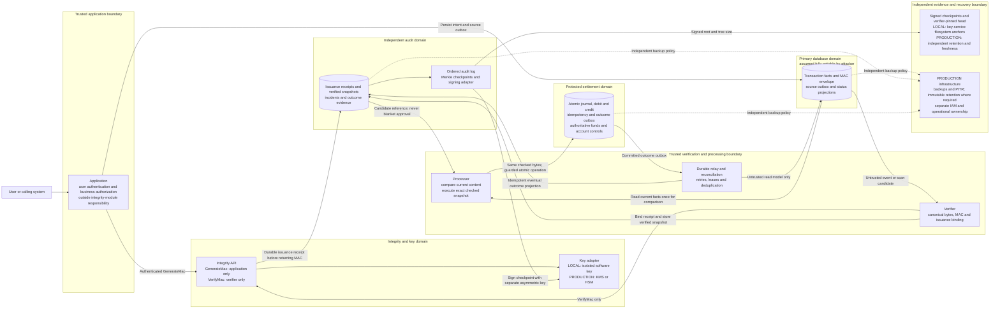

> Historical architecture and evidence. Physical topology and delivery were superseded on September 6, 2026; see ../ARCHITECTURE_UPDATE_2026-09-06_EN.md.

# Architecture: Current Code and Full Target

Status: local verification PASS, 2026-09-05. The complete recorded run passed standard Maven verification, PostgreSQL adversarial scenarios, a 120-second load experiment with zero throughput tolerance, and the final restart without test hooks. See [implementation status](../reference/implementation-status.md) for raw report paths and remaining gates. Production-only controls remain requirements, not implemented guarantees.

Related documents: [master plan and acceptance criteria](../reference/master-plan.md), [technical glossary](../reference/glossary.md), [presentation guide](demo-presentation.md), [visual workflow](workflow-2026-09-05.html), and [project overview](overview-2026-09-05.html).

## 1. Claim, threat model, and agreed scope

> Administrative access to the primary transaction database alone is insufficient to execute a forged, modified, or already settled operation. Execution requires authenticated content, independent evidence, and atomic, idempotent settlement outside that administrator's control.

This is the bounded design claim exercised by automated tests and recorded local PostgreSQL attack scenarios. Passing those experiments is evidence for their stated coverage, not proof against every attack or production certification.

The attacker may insert, modify, delete, replay, reorder, or restore primary database contents and disable its triggers. The attacker does not control the trusted application, integrity/key service, verifier, processor, independent audit store, settlement database, or their credentials. Compromise of the whole host or all trust domains is outside this guarantee.

The integrity layer does not provide data confidentiality, prevent database destruction, or by itself establish regulatory compliance. Recovery and availability require complementary infrastructure controls.

The integrating application authenticates its users and decides who may request a transfer or funding operation. End-user identity management, account ownership checks, and mandatory `actorId` or `authorizationEvidenceId` fields are not responsibilities of the integrity module. The module does enforce service access: only the trusted application may request `GenerateMac`; the verifier receives `VerifyMac` permission without generation permission or key access. A valid HMAC authenticates protected content, not the user's business entitlement.

The project supports technical conferences, public GitHub review, possible integrations, and the broader EB-2 NIW evidence package. Revenue is not an acceptance criterion. The initial performance target is **20 fully completed transfers per second under sustained load**, including durable terminal evidence, bounded backlog, latency reporting, and financial invariant checks. The accepted local 120-second experiment offered 20 TPS and completed all 2,400 operations with durable outcome evidence and correct balances. Its steady-state completion rate was 20.009 TPS after a 10-second warmup, with zero configured throughput tolerance; whole-run throughput including warmup and drain was 19.918 TPS. These are workload-specific measurements, not a general capacity guarantee or a 10-minute soak result; full conditions and report paths are in [implementation status](../reference/implementation-status.md).

## 2. Current local implementation — recorded PostgreSQL evidence

The legacy H2 trigger/volatile queue/shared-secret implementation has been removed. New code is packaged as three executable services, with an ordinary shared protocol JAR. Runtime PostgreSQL schema installation is explicit; H2 is only a test dependency.



Primary, audit and settlement runtime credentials are distinct. The application does not receive key bytes, verification/signing credentials or settlement SQL access. The processor cannot issue MACs. The local script/host administrator can access every process and secret; that actor is explicitly trusted.

The checked operation snapshot—not a subsequent untrusted SQL read—provides the amount and accounts used in settlement. Settlement commits both postings, balance updates, unique execution marker and outcome outbox in one protected database transaction. Primary status flags are projections, not authorization. Account creation/holds also have a protected durable audit outbox.

The local key service stores software keys; it is **not** a real KMS/HSM adapter. Signed anchors are files retained outside the audit database, not an independent observer host, trusted timestamp authority or WORM service. Merkle verification reconstructs the anchored prefix/tree; compact consistency proofs and incremental tree maintenance are not implemented.

The stack ran as three JVM services and three PostgreSQL instances on Windows/Docker. Standard `Maven clean verify` passed 75 automated tests (15 key/protocol, 36 processor, 24 application; 10 suites, no skips); the Node load-evidence suite passed 20 tests. The recorded PostgreSQL scenario report passed 15/15 checks. The accepted combined run `verification-2026-09-05T22-34-15-fccf37b1` passed build, harness tests, scenarios, 120-second load and normal-mode restart; load completed 2,400 distinct operations with zero failures.

An earlier combined run passed its load stage but failed the final restart because of a PowerShell 5.1 process-list JSON compatibility bug. That failure was retained, not relabeled; the corrected complete rerun passed. See [implementation status](../reference/implementation-status.md) for the report history and remaining evidence gates.

The separate [local recovery report](../evidence/local-recovery-2026-09-05.json) also passed: fixture setup plus two real JVM outages. With the processor stopped, an HTTP 503 followed durable source publication; zero postings existed during the outage, then restart drained the operation without client republication and an identical-key retry caused no second effect. With the key service stopped, a new issuance returned 503 with no receipt, source row or balance change; retry after restart settled once. Exact payload, postings, balances and audit evidence were checked, and normal-mode restoration passed. These tests do not cover host power loss, database outages, PITR, or key-service failure during an already verified in-flight settlement.

## 3. Full production target — logical boundaries and additional infrastructure



Arrows specify allowed flows, not unrestricted database access. The primary DBA must not be able to change evidence, settlement, account holds, processing permissions, service credentials, or pinned checkpoint keys. Two schemas or databases controlled by the same PostgreSQL superuser do not provide this separation.

The boundaries do not require a particular service count, multiple repositories, a broker, or a cloud provider. Durable database polling may satisfy the 20 transfers/second target if its correctness and capacity are demonstrated. Broker messages, if added, remain untrusted candidate references rather than payment authorizations.

## 4. Target sequence — issuance, verification, settlement, and recovery

```mermaid
sequenceDiagram
    participant A as Trusted application
    participant I as Integrity API and key adapter
    participant E as Independent audit store
    participant D as Primary transaction database
    participant V as Verifier
    participant P as Processor
    participant L as Protected settlement database
    participant R as Durable outcome relay
    A->>A: Existing user and business authorization
    A->>I: Authenticated GenerateMac for immutable operation
    I->>I: Validate canonical schema and compute MAC
    I->>E: Commit idempotent issuance receipt and content binding
    E-->>I: Receipt durable
    I-->>A: MAC, exact keyId, schemaVersion, receipt reference
    A->>D: Commit operation and source outbox in one local transaction
    D-->>V: Poll or deliver untrusted candidate reference
    V->>D: Read operation and MAC envelope
    V->>I: VerifyMac with verification-only permission
    I-->>V: Verification result
    V->>E: Resolve issuance binding for operation ID, version and hash
    alt Invalid MAC or mismatched independent evidence
        V->>E: Incident and operation quarantine
    else Valid MAC and independently bound issuance
        V->>E: Append verified canonical snapshot and hash
        E-->>P: Verified candidate reference
        P->>E: Read trusted snapshot, hash and identity
        P->>D: Read current operation facts once
        P->>P: Canonicalize and compare current content hash
        alt Current primary facts missing or changed
            P->>E: Quarantine; no money postings
        else Current content matches verified snapshot
            P->>P: Retain exact checked immutable bytes for execution
            P->>L: Begin transaction; claim unique operation identity and hash
            L->>L: Lock accounts; check trusted funds and account controls
            L->>L: Commit journal, debit, credit, result and outcome outbox
            L-->>P: Durable result or same result on identical retry
            L-->>R: Committed outcome outbox
            R->>E: Append outcome evidence idempotently
            R->>D: Update status projection idempotently
        end
    end
```

Required failure behavior:

- A key/evidence dependency outage permits no new unverified settlement. Work remains durably retryable. Unavailable dependencies are distinguished from confirmed invalid content.
- Issuance records what was authenticated, not whether a subsequent primary insert committed. Crashes can leave orphan receipts. Reconciliation applies a documented grace window and records unresolved discrepancies. A missing row alone is not evidence of a legitimate abort: `ABORTED` requires trusted rollback evidence, and expiration must not silently erase an anomaly.
- The processor executes the exact checked bytes; it does not reread mutable payment fields after comparing them. Later primary changes cannot change the posted amount or recipient, and history reconciliation records the discrepancy.
- Settlement identity and hash, journal, paired postings, result, and outcome outbox commit in one protected database transaction. An identical retry returns the existing result; the same identity with different content is rejected. Insufficient funds or a protected account hold produces rejection without partial postings.
- Funds and account controls used for settlement are authoritative in the protected domain, not mutable primary account rows.
- Audit and primary status are eventual projections. There is no claimed cross-database ACID transaction. If a relay crashes after settlement, its outcome outbox repairs projections without repeating money movement.
- A primary `COMPLETED` status or the existence of a verified row never independently authorizes settlement.
- Operation quarantine is mandatory on confirmed mismatched content. Automatic recipient account blocking remains unresolved: the user prefers blocking, while the architectural concern is that an attacker can name an innocent recipient to cause denial of service.

## 5. Canonical data, corrections, and history

The implemented v1 byte-exact canonical protocol includes operation UUID/version, ledger/domain identity, operation type, source and destination, integer amount and currency, exact UTC timestamp precision, correction/reversal reference where applicable, and protocol/key binding. Explicit type and byte-length rules distinguish null from text/UUID/integer values; all fields must be present, nullable relation must explicitly be null. Text identifiers use a restricted ASCII alphabet, not implicit Unicode normalization. Golden test vectors specify input, canonical bytes, and MAC. Unsupported schema versions are rejected.

HMAC-SHA256 provides internal content authentication. It is not encryption, public verification, or legal non-repudiation. Historical records retain exact key identifiers. Correction creates a new authenticated operation; an already executed transfer uses a compensating operation and replacement where needed. Funding follows the same protected path and has a balancing system account. Confirming that external money actually arrived remains an integration responsibility.

Ordered audit events feed Merkle checkpoints signed with a separate asymmetric key (Ed25519 in the local implementation). A checkpoint binds log identity, tree size, root, algorithm/version, and checkpoint context. An external verifier requires trusted public keys, inclusion/consistency proofs, and a sufficiently recent independently retained checkpoint. A MAC chain or Merkle root stored only beside mutable data cannot detect a mutually consistent historical rollback. A hash chain is an alternative design, not a mandatory intermediate implementation or an existing feature.

Independent issuance/settlement evidence, reconciliation, and anchored history address deletion. A row HMAC or auto-increment gap alone does not prove completeness. Backups/PITR and independent retention provide recovery and surviving evidence; HMAC does not prevent `DROP DATABASE` or guarantee availability.

## 6. Implementation coverage and deployment adaptation

| Property | Local code now | Additional production requirement |
|---|---|---|
| Runtime / storage | 3 JVMs and 3 PostgreSQL instances with scoped roles; recorded local startup/scenario/load evidence | Independent IAM/administrators, deployment and availability controls |
| Application permission | Authenticated demo caller; host app owns user authorization | Integrating identity/business policy, TLS/mTLS and service identity lifecycle |
| Keys | Restricted issue/verify/sign/admin roles; software keys and rotation | Real KMS/HSM provider, independent custody, recovery and deployment review |
| Canonical protocol | Versioned byte-exact TLV, key/ledger/currency/type/link binding and vectors | Historical version support and reviewed interoperability |
| Settlement | Protected atomic paired postings, locks, unique journal and outboxes | Equivalent boundary at real financial execution / external rails |
| Delivery / evidence | Durable inbox/leases/retry/relay, issuance inventory and audit; processor and new-issuance key-service JVM outage/recovery tests passed | Wider crash-boundary, database-outage and failover testing; operational objectives |
| Funding / correction | Authenticated treasury funding; completed reversal then replacement | External funding evidence, approvals; pre-settlement cancellation not implemented |
| History | Ed25519 checkpoints, inclusion proofs, filesystem anchors; full-tree prefix check | Independent retained/fresh heads, trusted public-key distribution, scalable trees |
| Retention / recovery | Containers/volumes retained; no WORM/PITR recovery exercise | Backups/PITR, immutable retention and independent recovery drills |
| Performance | 120-second local load passed: 2,400 completed, zero failures; steady and drain-inclusive rates reported separately | Capacity planning based on measured workload |
| Incident response | Invalid operations quarantined; manual protected holds | Evidence-based blocking policy and operational playbooks |

## 7. Evidence before claiming completion

The required evidence includes normal transfer and protected funding, tamper/fabrication/replay/deletion/TOCTOU rejection, crash recovery across issuance and settlement boundaries, concurrency and balanced-posting invariants, permission-denial tests using primary DBA credentials, historical key verification, correction binding, checkpoint verification, and a reproducible 20 completed transfers/second sustained benchmark. The master plan defines detailed acceptance criteria and measurement windows.

The current diagram is an implementation inventory backed by the specific tests and local reports listed above. It does not imply that every item in the broader evidence program has passed: host power loss, database outages, PITR, key-service outage during in-flight settlement, independent production custody and external review remain separate gates. The production diagram is a design requirement, not a deployed system. Use [implementation status](../reference/implementation-status.md) to distinguish recorded local results from remaining work.
