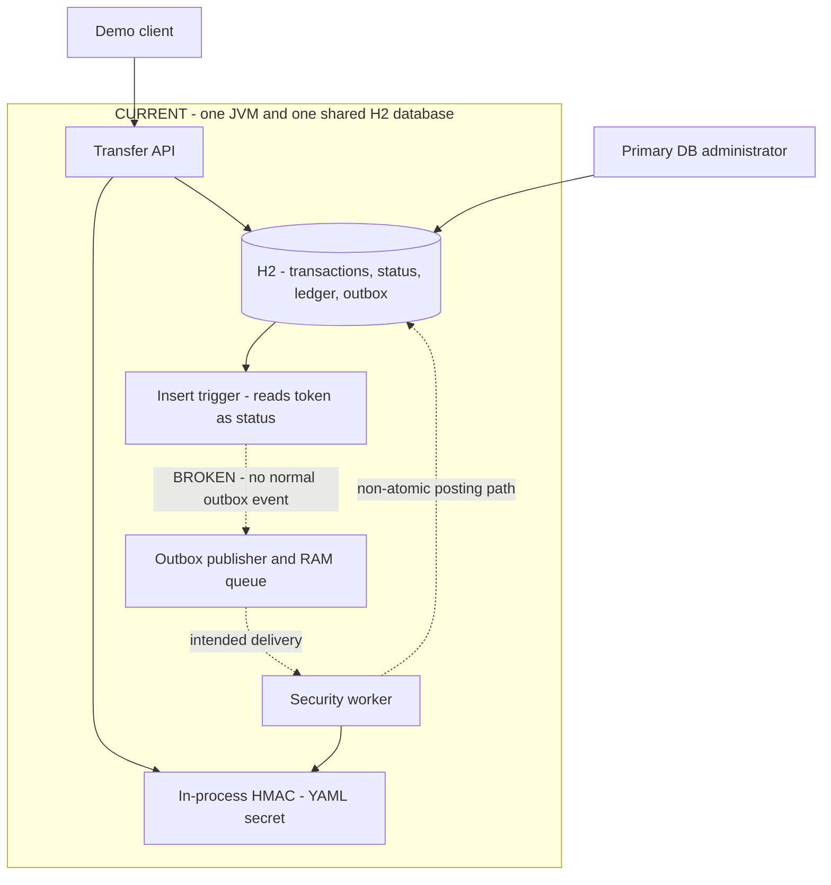
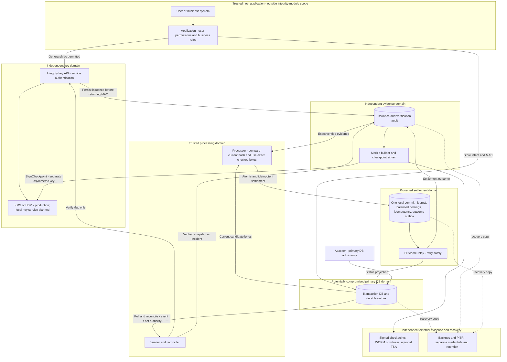

# Secure Transaction Integrity — Project Master Plan

> September 6 topology update: [Main + Audit/Protected with embedded ActiveMQ](architecture.md) supersedes physical three-database and direct outbox-to-inbox descriptions below. Requirement IDs and historical evidence remain preserved. September 5 metrics describe the earlier topology only.

Status: original plan preserved; full local verification PASS (120 seconds, 20 TPS, zero tolerance); remaining checks are in implementation-status.md  
Recorded on: 2026-09-05  
Purpose: a single source of context, decisions, requirements, and acceptance criteria

Implementation update, 2026-09-05: the complete local `verify-local` run passed, including the final restart without test hooks. Standard Maven `clean verify` passed 75 tests; Node load-evidence passed 20 tests; scenarios on three PostgreSQL instances and three JVMs passed 15/15. The accepted 120-second load run completed all 2,400 operations without errors: 20.009 TPS in the steady window after 10 seconds of warmup with zero tolerance, and 19.918 TPS over the whole run including drain. This is neither a 10-minute soak nor production certification. Raw reports, the history of an earlier restart failure, and outstanding checks are in [implementation-status.md](implementation-status.md). The original H2 prototype inventory and design decisions are preserved below: references to the “current prototype/not implemented” in historical sections describe the pre-rewrite baseline, not the new code. The new [architecture](architecture-decisions.md) and [README](../../README.md) describe three services / PostgreSQL. Historical acceptance criteria are not automatically checked off: existing code, an individual passing test, and complete aggregate acceptance are different levels of evidence.

The additional [local recovery run](../evidence/local-recovery-2026-09-05.json) also passed: fixture setup and two actual JVM outages — processor shutdown followed by automatic, exactly-once execution of an already published operation, and key-service shutdown refusing new issuance until recovery. Exact fields, postings, balances, and audit were checked; the final normal restart passed. Whole-host power loss, database outages, PITR, and key-service failure during an already verified in-flight operation were not tested.

Educational explanations of terms are in the companion [glossary.md](glossary.md).

Architecture materials: [two visual diagrams](../history/workflow-2026-09-05.html), [technical description and Mermaid](architecture-decisions.md), and [presentation script](../history/demo-presentation.md).

Agreed on 2026-09-05: the target is **20 completed transfers per second**, reconfirmed by the user; the local version uses PostgreSQL/Docker without cloud accounts; the trusted main application checks users' business permissions. The integrity module restricts service access to GenerateMac/VerifyMac, but does not build its own Identity Provider or require actorId. Docker Client/Server 29.7.2 and an actual PostgreSQL run are now available from the agent environment. Production KMS/HSM, independent IAM/administrators, WORM, and TSA are not implemented and are not presented as properties of the local demo.

Language update: the user's current instruction is English-only for all project content, including code, comments, scripts, UI, notes, and documentation. Earlier decisions below that called for English public materials and Russian educational explanations are retained only as historical context; they have been superseded by this instruction.

## 1. Short Answer

Yes, almost everything discussed can be implemented in this repository as a strong local demo. However, four levels must be distinguished honestly:

| Level | Result | Feasibility | Complexity |
|---|---|---:|---:|
| Corrected PoC | The existing scenario actually progresses from PENDING to COMPLETED | Entirely local | M |
| Convincing security demo | Forgery, replay, deletion, and TOCTOU are demonstrated through tests and attack scenarios | Entirely local, preferably PostgreSQL/Docker | L |
| Production-aligned reference | KMS adapter, separate roles and trust domains, reliable queue, Merkle checkpoints | Most is implementable; cloud boundaries are partly simulated | XL |
| Production/compliance | Real HSM/KMS, independent accounts, WORM, operating procedures, audit, and certification | Requires infrastructure and organizational processes outside the repository | Separate work program |

Relative complexity scale:

- S — a local change or small artifact;
- M — several related changes and tests;
- L — a separate workstream involving a model change/integration;
- XL — several workstreams, infrastructure, or independent security review.

This is a relative estimate, not a calendar commitment. For one engineer, a strong local demo is work on the order of several weeks; production readiness is a multi-sprint team effort.

The project's principal recommended guarantee:

> Access to the primary Transaction DB alone is insufficient to execute a forged or modified transaction. Financial execution is permitted only from a cryptographically verified immutable snapshot recorded in an independent trust domain, while an idempotent ledger prevents repeated execution.

This guarantee deliberately does not mean that the module:

- prevents deletion or shutdown of the entire database;
- maintains data confidentiality;
- withstands simultaneous compromise of the Transaction DB, Integrity Service, keys, and Processing/Ledger;
- independently establishes compliance with SEC, FDA, or another rule;
- is a new cryptographic primitive or a complete ledger DBMS.

## 2. What We Are Building

Working name: **Secure Transaction Integrity Layer**.

Positioning:

- a verifiable integrity layer for existing relational systems;
- does not require moving the entire application model into a specialized ledger database;
- uses standard cryptographic primitives; the project's contribution is their secure engineering integration;
- separates the primary database, keys, verification log, and financial execution across trust boundaries;
- provides reproducible evidence: attack tests, audit records, Merkle checkpoints, and performance measurements.

Audiences: technical conferences, security review, potential users, public GitHub, and EB-2 NIW materials. Commercial revenue is not a mandatory objective. A real deployment is desirable as an independently verifiable result. The historical working arrangement used English public materials and Russian educational context, with new translations agreed as presentations were prepared. The current English-only instruction above supersedes that arrangement.

The term **tokenization** is inaccurate for the current project: the code does not replace sensitive data with surrogate tokens; it computes HMAC. The module should be renamed **integrity-authentication** or **integrity-signing**.

## 3. Current Repository State

At this historical baseline, this is a Java 21 / Spring Boot 3.3.5 modular monolith with three Maven modules:

- **account-transfer-app** — REST API, accounts, transfer intents, ledger, and H2;
- **tokenization-module** — HMAC-SHA256 over a string representation of fields;
- **transaction-security-module** — H2 trigger, outbox polling, in-memory queue, and verification worker;
- **docs** — landing page, workflow, architecture decision, and presentation script.

A useful foundation already exists:

- amounts are stored as integer minor currency units;
- balances are derived from ledger entries rather than a mutable account field;
- transaction facts are separated from status history;
- HMAC binds the transaction UUID, both accounts, amount, and time;
- account and transfer-intent creation have a transaction boundary;
- security-module ports are separated;
- the documentation already explains the difference between the demo and the proposed production architecture.

### 3.1. Blocking Defects in the Current Implementation

| ID | Issue | Consequence | Priority |
|---|---|---|---:|
| CUR-001 | TransactionOutboxTrigger reads newRow[5] as status, but it is the token column | No outbox entry is created; all transfers remain PENDING | P0 |
| CUR-002 | validateAndComplete is called from the same bean, bypassing its @Transactional | PROCESSING, debit, credit, and COMPLETED are not atomic | P0 |
| CUR-003 | The same DB principal can write ledger, status events, outbox, and accounts | An attacker bypasses HMAC by writing directly to ledger/status/outbox | P0 |
| CUR-004 | One passwordless sa user, enabled H2 console, and demo-secret in application.yml | No real separation of trust | P0 |
| CUR-005 | Outbox is marked processed immediately after an event enters a volatile RAM queue | Process failure loses events | P0 |
| CUR-006 | No idempotency or ledger-posting uniqueness | Replaying an event can debit funds again | P0 |
| CUR-007 | No locking/CAS during balance checks and state transitions | Double processing and overspend are possible | P0 |
| CUR-008 | Status and ledger are called immutable only in prose | UPDATE/DELETE remain physically possible | P0 |
| CUR-009 | No automated tests | A green mvn test means zero tests, not evidence | P0 |
| CUR-010 | MAC is returned through the API; the key is weak/shared; comparison uses String.equals | Unnecessary exposure and a weak key model | P1 |
| CUR-011 | Canonical string lacks a version, keyId, and byte-level specification | Inter-service compatibility and rotation are undefined | P1 |
| CUR-012 | Corrections/reversal, incident records, and deletion detection are absent | Central requirements are not yet represented in code | P1 |
| CUR-013 | Latest status is selected only by MAX(created_at) | Equal/future timestamps make the result ambiguous | P1 |
| CUR-014 | H2 Java triggers and an in-memory broker are not a production boundary | Architectural claims exceed the implementation | P1 |
| CUR-015 | Demo API does not check end-user permissions | Application limitation: safe integration assumes these checks are performed by the trusted host application; building user authorization is outside the integrity module's scope | APP assumption |
| CUR-016 | POST /accounts directly creates INITIAL_CREDIT with transaction_id = NULL | Funds are created outside the integrity, evidence, and idempotency flow | P0 |
| CUR-017 | Worker does not recheck both account statuses immediately before settlement | An account blocked after intent creation can still participate in a posting | P0 |
| CUR-018 | No crash-safe protocol is defined between the independent Audit Store and Settlement Ledger | One ACID transaction across databases cannot honestly be promised; settlement may commit without terminal evidence | P0 |
| CUR-019 | No continuous history re-verification after COMPLETED | Later primary-row tampering may produce no incident | P1 |
| CUR-020 | Integrity scope is defined only for transfer facts | Status/account-status/ledger/audit events may remain tamperable projections | P1 |
| CUR-021 | Runtime startup executes DDL through schema.sql | Runtime identity effectively assumes DROP/CREATE TRIGGER privileges | P1 |
| CUR-022 | No upper monetary limits or overflow policy | Long.MAX_VALUE, SUM(BIGINT), and sign changes may violate financial invariants | P1 |

Until CUR-001 and CUR-002 are fixed, the project cannot be presented as a working happy-path demo or as “minimal but correct.” Until all P0 items are closed, the claimed security guarantee cannot be demonstrated.

### 3.2. Secondary Defects That Must Still Be Addressed

These points do not change the central architectural idea, but distinguish a reproducible engineering artifact from a fragile prototype:

| ID | Observation | Required direction |
|---|---|---|
| CUR-023 | Create account returns 200 instead of 201, async transfer 200 instead of 202, not found 400 instead of 404 | Define an HTTP contract and integration tests |
| CUR-024 | DTO name lacks max=120 although the DB has VARCHAR(120) | Align API and DB validation |
| CUR-025 | List endpoints lack pagination, limits, and stable cursors/order | Introduce bounded pagination |
| CUR-026 | No OpenAPI, API versioning, or stable error schema | Publish a machine-readable contract |
| CUR-027 | TransactionResponse.updatedAt actually means the latest status-event time | Rename to statusChangedAt or change its semantics |
| CUR-028 | Status contract is duplicated as enums and strings between modules | Introduce a shared typed contract/versioned event schema |
| CUR-029 | from_account_id != to_account_id is checked only in the service layer | Add a DB invariant |
| CUR-030 | Unknown status/event values cause Enum.valueOf exceptions | Produce a controlled incident/quarantine |
| CUR-031 | LinkedBlockingQueue is unbounded, producer publishes batches, consumer reads individually | Remove the RAM queue or bound capacity and concurrency |
| CUR-032 | No backpressure/admission policy | Define queue depth, throttling, drain, and overload behavior |
| CUR-033 | Outbox is sorted only by timestamp | Add a deterministic tie-breaker/sequence |
| CUR-034 | Scripts expect gitignored local JDK/Maven and depend on the current directory | Add Maven Wrapper/bootstrap and cwd independence |
| CUR-035 | No CI pipeline | Check a fresh Java 21 build, tests, and PostgreSQL profile |
| CUR-036 | CREATE TABLE IF NOT EXISTS does not migrate an old persistent H2 schema | Introduce Flyway/Liquibase and migration tests |
| CUR-037 | Persistent H2 state has no safe reset/seed | Make the demo deterministically reproducible |
| CUR-038 | H2-specific triggers are in the main security module | Move them to a demo/H2 adapter |
| CUR-039 | Instant.now() is not abstracted | Introduce Clock for deterministic time tests |
| CUR-040 | Application timestamp is not a trusted timestamp | Separate ordering sequence, observedAt, and externally attested time |
| CUR-041 | No read-only API for complete status/ledger/evidence/incident history | Add a protected audit view with pagination |
| CUR-042 | No correlation IDs, structured logs, health/readiness, or worker metrics | Add a minimal observability model |
| CUR-043 | Raw exception messages are returned to clients | Introduce stable public error codes without internal leakage |
| CUR-044 | Consumer does not check event_type | Validate type/version and route unknown events to DLQ/incident |

A total of 44 observations were recorded at the audit date. This is the baseline: an item is closed only with a link to a change and a validating test/evidence, not a verbal “fixed.”

CUR-015 is retained as a fact about the current demo and explicitly reclassified by user decision: it is an integration assumption for the main application, not a requirement to build an Identity Provider inside the module. This scope change does not make an open, unprotected demo API safe for public use.

## 4. Threat Model

### 4.1. Protected Assets

- authentic transfer-intent payload;
- the decision permitting execution;
- absence of duplicate debits;
- completeness and ordering of audit history;
- key material;
- verification evidence;
- ledger balances and double-entry bookkeeping.

### 4.2. Attacker Levels

| Level | Attacker capabilities | What the project must guarantee |
|---|---|---|
| T0: read-only DB leak | Reads the primary database | Cannot modify or execute a transaction; confidentiality is not provided by this project |
| T1: primary-DB DML writer | INSERT/UPDATE/DELETE in Transaction DB | Cannot create an executable forgery, alter amount/recipient, replay, or directly modify the protected settlement ledger |
| T2: primary-DB admin/DDL | Can disable triggers, change schema, or delete the primary database | Cannot forge already externally committed evidence or obtain settlement; can cause denial of service |
| T3: compromised Transfer API | Can send requests as the trusted application | Outside the main guarantee: HMAC alone cannot detect misuse of authorized GenerateMac; application authorization remains the integrator's responsibility |
| T4: compromised Integrity/KMS/Audit/Processor | Gains access to the trusted plane | Outside the main cryptographic guarantee; mitigated by HSM, IAM, independent accounts, four-eyes control, and key-use logs |
| T5: full cloud/host compromise | Controls all domains and backups | Not covered by one application; independent external copies and organizational controls are required |

### 4.3. Explicit Security Goals

- SG-001: changing any protected field causes MAC verification to fail.
- SG-002: a forged record without an authorized Integrity Service call does not gain processing permission.
- SG-003: redelivery, a repeated status event, or replay of the source row does not create another ledger posting.
- SG-004: the processor uses exactly the bytes that were checked, not merely the fact of a past verification.
- SG-005: deletion, truncation, or reordering of audit entries is detected relative to an externally retained checkpoint.
- SG-006: compromise of the Transaction DB alone does not grant write access to the Verification/Audit Store or Settlement Ledger.
- SG-007: Integrity Service unavailability leaves the operation durably pending/retryable and allows no bypass; QUARANTINED is for integrity conflicts, not ordinary temporary unavailability.
- SG-008: the key is not stored in the primary database, source code, API responses, or logs.
- SG-009: every claimed guarantee has an automated test or reproducible evidence.

### 4.4. Non-goals

- payload encryption and leakage prevention;
- end-user authentication as a separate identity system;
- protection after compromise of all trust domains;
- absolute availability;
- a legal opinion or automatic compliance certification;
- creation of a new HMAC, signature, or Merkle-tree algorithm.

### 4.5. Contract with the Main Application

The main application is trusted: it checks users, account ownership, and business-command eligibility before requesting a MAC. These mechanisms appear on the target diagram as external integration context and do not become new modules in this project.

The integrity module's scope retains caller-service authentication, GenerateMac permission only for the trusted writer, VerifyMac for the verifier, key/operation-type restrictions, and key-use auditing. Possession of DB credentials does not confer these service permissions. actorId and user authorization receipts are not mandatory for protocol v1; they may be added in a specialized integration.

## 5. Two Types of Architecture Diagrams

Every diagram has an explicit status. **CURRENT** means the verified structure of the current code, including defects; **TARGET** is the agreed implementation direction. **PLANNED LOCAL** describes a future local adaptation of the target, while **PRODUCTION INFRASTRUCTURE** describes components and independent administrative boundaries outside the laptop. Showing a component on a target diagram does not mean it already works in the demo.

### 5.1. CURRENT — What Is in the Repository Now

A normal insert remains PENDING because of CUR-001. The worker path exists in code, but its presence does not prove a working happy path. CUR-002 breaks atomicity when the worker is called; shared access to ledger/status and the configuration key does not create independent trust domains. H2 triggers are useful against ordinary UPDATE/DELETE, but do not provide the claimed protection against the database owner.

### 5.2. TARGET — Correct Architecture and Assumptions

The number of blocks denotes responsibilities and access boundaries, not a mandatory number of microservices or repositories. An external broker is optional: for the 20 TPS target, start with a durable DB outbox, lease/retry, and reconciler. Separate schemas under one PostgreSQL superuser do not protect against that superuser; the demo DBA scenario requires separate instances/administrators for primary and protected stores.

Key target properties:

1. Primary DB is not the source of financial-action authorization. The trusted application checks user permissions before requesting a MAC.
2. GenerateMac is available only to the trusted application identity; VerifyMac is available to the verifier. Primary DB credentials grant neither key access nor MAC-generation permission.
3. Integrity Service confirms an independent MAC_ISSUED record before returning a MAC. A missing primary row creates an anomaly. A reliably confirmed rollback may be recorded as a new ABORTED event; row absence alone does not prove rollback. EXPIRED does not erase evidence or end investigation of the discrepancy.
4. Verifier stores the exact canonical payload/contentHash, MAC, keyId, schemaVersion, and result. Settlement must not be authorized merely by the existence of VERIFIED.
5. Processor compares current canonical bytes with verified evidence and executes precisely that checked snapshot. Detected mismatch/missing records stop the operation. Changing the primary row after the read does not change the in-memory snapshot; subsequent reconciliation detects it. This is not a promise of atomicity between two independent databases.
6. Settlement DB atomically commits the journal, debit, credit, unique idempotency marker, and outcome outbox. It contains authoritative balances and account holds that the primary DBA cannot change through an accounts row. Later status/audit projections are repaired by redelivery. The primary DBA cannot write here directly.
7. Merkle checkpoints include log identity, treeSize, root, time, version, and signing key ID. External retention and a highest-seen/freshness policy are needed to verify tail deletion and rollback. Data is recovered from backups/PITR, not from the root hash.
8. Reconciler compares primary rows, issuance, verification, and settlement, including already completed operations; disabling a trigger does not disable reconciliation.

### 5.3. How the Local Version Will Align with the Target

| Area | CURRENT | PLANNED LOCAL | PRODUCTION INFRASTRUCTURE |
|---|---|---|---|
| Databases and access | Shared H2 / sa | PostgreSQL in Docker, separate instances/credentials | Independent administrative access, networks, and accounts according to the threat model |
| MAC and keys | In-JVM HMAC, YAML secret | Separate key service, service credentials, local keystore | Non-exportable KMS/HSM keys, IAM, audit, and rotation |
| Events | Broken trigger and RAM queue | Durable outbox, lease/retry, reconciliation | HA/monitoring; external broker only if needed |
| Financial execution | Shared mutable ledger; no idempotency | Protected journal and atomic idempotent postings | Operating procedures and recovery |
| Evidence | No independent evidence store | Issuance/verification audit and signed Merkle checkpoints | WORM/external witness, RFC 3161 if required |
| Recovery | Not demonstrated | Local restart/restore exercises | Backups/PITR outside primary DBA authority, retention, and recovery drills |
| Load | Not measured | Target: 20 completed TPS | SLO/capacity defined by measurements of the specific deployment |
| User permissions | Not implemented by the educational API | Assumed in the trusted host application | Integrator's identity and business authorization |

On one laptop, the host/Docker administrator is trusted. Local checkpoint export demonstrates the mechanism; independence from the laptop administrator requires an external environment. The presentation first explains TARGET, then CURRENT and this coverage table.

Document checks, 2026-09-05: local links and anchors resolve; six inline SVGs in two HTML files parse as XML; ID/marker references and original text coordinates were checked. The pages require no CDN, scripts, or external resources. Browser visual QA was not performed: the in-app browser rejected file:// under its URL policy. This is a display-verification limitation, not evidence of a diagram defect or a check of application operation.

## 6. Design Decision Register

Statuses: **Proposed** — a recommended decision that can still change; **Accepted for the plan** — a baseline assumption for subsequent work.

### DEC-001. Wording of the Guarantee

Status: **Accepted for the plan**.

Do not say “even the database administrator cannot do anything.” Say: “compromise of the primary database is insufficient for forged settlement while the independent trust domains remain intact.” A full primary DBA can still cause DoS or delete the source.

### DEC-002. Canonical Representation

Status: **Proposed**.

For v1, use a formal binary TLV encoding and treat RFC 8785 as a known alternative/precedent. Reason: this domain has a small fixed set of UUIDs and integers; a binary format is easier to specify byte for byte and does not depend on JSON number/date serializers.

Each field is encoded as:

    tag:uint16 big-endian
    state:uint8          // 0 = absent, 1 = explicit NULL, 2 = value present
    length:uint32 big-endian
    value:length bytes

Field order is fixed by the specification. An unknown tag is not arbitrarily reordered. No string delimiters or locale-dependent formatting.

Proposed protected v1 fields:

| Order | Field | Encoding |
|---:|---|---|
| 1 | domainSeparator | fixed ASCII bytes SECURE_TRANSFER_INTENT |
| 2 | canonicalizationVersion | unsigned 16-bit big-endian |
| 3 | macAlgorithm | fixed enum HMAC_SHA_256 |
| 4 | keyId/keyVersion | UTF-8 with length prefix |
| 5 | transactionId | 16 raw UUID bytes in network order |
| 6 | ledgerId | UUID of the specific financial journal |
| 7 | tenantId | UUID; nullable only if the system is unambiguously single-tenant |
| 8 | operationType | TRANSFER, FUNDING, REVERSAL, or CORRECTION |
| 9 | fromAccountId | UUID |
| 10 | toAccountId | UUID |
| 11 | amountMinor | signed int64 big-endian, DB constraint greater than zero |
| 12 | currency | exactly 3 uppercase ASCII bytes according to ISO 4217 |
| 13 | createdAtEpochMicros | signed int64 big-endian, UTC instant without precision loss |
| 14 | correctsTransactionId | UUID or explicit NULL |
| 15 | reversesTransactionId | UUID or explicit NULL |
| 16 | idempotencyKey | UUID or bounded UTF-8 string |
| 17 | policyVersion | unsigned 32-bit big-endian |

For `state=0` and `state=1`, length is zero and value is absent. For `state=2`, length may be zero, meaning a present empty value. Thus absent, NULL, and empty have different canonical bytes.

Account display name, current status, and human-readable failure reason are not included in the transfer-intent MAC: they are other entities/events. If they must be protected, they need their own canonical schema.

actorId, authorizationEvidenceId, and authorizationEvidenceHash are excluded from mandatory fields under the agreed module boundary. The calling application's service identity is retained in key-service operation audit; end-user information remains the host application's responsibility. FUNDING defines a system counter-account and a protected reference to its funding basis; checking that external funds actually arrived is an application integration contract.

Required artifacts:

- formal byte-level specification;
- hex dump of canonical bytes;
- golden test vectors “record → bytes → MAC”;
- negative vectors for NULL/empty, field order, one-bit changes, time precision, and Unicode;
- identical results in at least two independent implementations, or in production and a reference verifier.

### DEC-003. Correction and Reversal

Status: **Accepted for the plan**.

- The original intent is neither UPDATEd nor DELETEd.
- Before settlement, only new status events are allowed: CANCELLED or SUPERSEDED.
- After settlement, create a new compensating REVERSAL with a new UUID and mandatory reversesTransactionId.
- The corrected business payment is a separate new TRANSFER/CORRECTION with correctsTransactionId.
- The reference, operationType, and original-record identifier are included in canonical bytes and the MAC.
- One reversal cannot execute twice; a unique constraint and state machine enforce this.
- Compensation does not rewrite history or claim that the original operation “never happened.”

### DEC-004. Keys

Status: **Accepted for the plan**.

Production:

- the key is created and used inside KMS/HSM;
- the raw key is not exported;
- trusted application identity receives only GenerateMac for the permitted context;
- verifier identity receives VerifyMac but not GenerateMac; the selected provider/adapter must support this separation;
- DB users, end users, and Processor do not receive the raw key;
- every key use is logged;
- keyId is stored beside the MAC and included in canonical input;
- after rotation, the old key remains verify-only for the history-retention period, or historical records receive a separate long-term attestation.

Local demo:

- KeyProvider/KmsMacClient interface;
- explicitly named LocalDevMacProvider;
- a separate key-service process/container with different credentials for MAC generation and verification;
- the secret comes from environment/temporary keystore, not Git or DB;
- a startup banner states that this is not an HSM;
- an optional real-cloud profile is connected separately.

### DEC-005. HMAC and Public Verifiability

Status: **Accepted for the plan; not yet implemented**.

- Retain HMAC-SHA256 for internal transaction admission.
- Sign periodic Merkle roots with an asymmetric key, preferably Ed25519 where supported by the chosen HSM/KMS.
- The public key may be given to an auditor; the private key remains inside the signer boundary.
- Add an optional RFC 3161 TSA or external publication of a checkpoint digest for independent time confirmation.
- Do not claim that a digital signature alone automatically provides legal non-repudiation: identity, key custody, timestamp, policy, and evidence matter.

### DEC-006. Deletion Detection

Status: **Accepted for the plan**.

Per-row HMAC does not detect disappearance of the entire row. Auto-increment/sequence reveals a possible gap, but is not cryptographic proof by itself because rollback can produce gaps.

Recommended target:

- audit store assigns a monotonic auditSequence;
- canonical audit leaf includes sequence, transaction/version, result, contentHash, MAC metadata, and previous business reference;
- leaves enter an append-only Merkle tree;
- checkpoint contains treeSize, rootHash, createdAt, signatureAlgorithm, signingKeyId, and signature;
- checkpoints are copied to a separate trust domain/WORM or published to an external observer;
- an inclusion proof proves a record's presence;
- a consistency proof proves that the new state extends the previously published state.

RFC 9162, which superseded RFC 6962, is used as a design source, but the demo is not called a Certificate Transparency implementation.

### DEC-007. TOCTOU Protection

Status: **Accepted for the plan**.

The existence of a VERIFIED row is insufficient. Processor must:

1. atomically claim the verification record;
2. obtain the canonical snapshot/contentHash from the independent audit store;
3. read the current primary candidate and compare canonical bytes/hash with verified evidence; on missing/mismatch, create an incident without postings;
4. execute precisely the snapshot that was compared, without rereading mutable primary-DB fields;
5. create the journal, balanced postings, idempotency marker, and outcome outbox in one Settlement DB transaction; complete terminal projections using the crash-safe protocol in DEC-011.

A detected change before the final check moves the operation to QUARANTINED. Primary-row tampering after the final read does not change the executed snapshot and is detected by subsequent reconciliation; no modified payload is used. Comparing hashes without binding execution to those same bytes leaves a TOCTOU hole.

### DEC-008. Degraded Mode

Status: **Accepted for the plan**.

Fail closed by default:

- if KMS, verifier, or audit store is unavailable, the intent remains PENDING_VERIFICATION;
- the event stays in a durable queue and is retried with backoff;
- after the attempt limit, it enters DLQ/NEEDS_REVIEW;
- bypassing verification with a configuration flag is prohibited;
- a separate emergency mode, if ever added, requires explicit approval and audit and is outside the demo.

### DEC-009. Response to a Suspicious Record

Status: **Proposed**.

Do not automatically block both accounts: a forged intent enables DoS against an innocent recipient. Baseline action:

- QUARANTINE the transaction;
- create an incident;
- create no ledger posting;
- notify the operator;
- block/restrict an account only under a separate risk policy.

The user proposed automatically blocking the recipient; after discussing the risk of blocking an innocent account, the final rule has not yet been approved. Target diagrams must include stopping the suspicious operation and creating an incident; automatic account blocking cannot be labeled an agreed guarantee.

### DEC-010. Demo Database

Status: **Accepted for the next local version; not yet implemented**.

- Retain H2 only for fast unit/smoke tests.
- Run the judge-ready demo on PostgreSQL through Docker Compose/Testcontainers.
- For the primary DBA threat, separate Primary DB and protected Audit/Settlement DBs into independent PostgreSQL instances with different credentials and administrators. Schemas/GRANTs inside one instance with a shared superuser are insufficient.
- Present MySQL as a second adapter/roadmap item, not a promise of full portability without tests.

### DEC-011. Atomicity Across Independent Stores

Status: **Accepted for the plan**.

Do not depict one ACID transaction across Primary DB, Audit Store, and Settlement Ledger. The authoritative local commit boundary is in Settlement DB and atomically contains:

- journal entry;
- two balanced postings;
- idempotency marker;
- settlement outcome outbox.

Primary-status updates and terminal audit evidence are projected idempotently from the outcome outbox. If the process fails after ledger commit, retry finds the existing journal by its unique key, does not move money again, and completes the missing projections. Reconciler detects a ledger outcome without a corresponding audit/status result.

### DEC-012. Scope and Target Load

Status: **Agreed with the user on 2026-09-05**.

The main scenario is compromise of the primary DB alone while the application, key service, audit, and settlement remain trusted. The module does not implement a user Identity Provider, account ownership, or separate business authorization receipts. It restricts service GenerateMac/VerifyMac, verifies unchanged data, and prevents forged/repeated financial effects.

The initial target is **20 completed transfers per second** on a documented local configuration. This is a target acceptance criterion, not a current result or production-capacity claim. Enqueueing does not count as a completed transaction. The mandatory test does not require 167 TPS; one million records remains an additional scale experiment.

## 7. Implementation Plan

### Phase 0. Establish the Contract and Project Language

Complexity: S.

- [x] PLAN-001: create this master plan.
- [x] PLAN-002: create a separate Russian-language glossary (historical completion; now translated into English under the current language requirement).
- [x] PLAN-003: agree on the primary-DB-attacker boundary with a trusted host application and protected plane.
- [x] PLAN-004: select PostgreSQL/Docker for the next local version; the user reported installing Docker.
- [x] PLAN-005: accept per-record HMAC + asymmetrically signed Merkle checkpoints for the plan.
- [x] PLAN-006: select a local key service; cloud accounts are unnecessary for the first phase.
- [x] PLAN-007: confirm EB-2 NIW, conferences, GitHub, and potential deployment as audiences/directions.
- [x] PLAN-008: agree on 20 completed TPS and exclude building user authorization from the module's scope.

Acceptance criteria:

- the same term has the same meaning in every file;
- assumptions, evidence, and residual risk are explicit for every security claim;
- the word tokenization is not used for HMAC;
- demo, production target, and future research are visually separated.

### Phase 1. First Make the Existing Demo Truthful

Complexity: M.

- [ ] REL-001: write an integration test reproducing permanent PENDING.
- [ ] REL-002: remove the trigger's dependence on status ordinal; INSERT transaction always generates a durable verification request.
- [ ] REL-003: a direct DB INSERT without status does not break the worker; it creates an INVALID/QUARANTINED incident.
- [ ] REL-004: move the transactional worker to a separate bean or use TransactionTemplate.
- [ ] REL-005: execute PROCESSING/ledger/terminal result atomically.
- [ ] REL-006: determine latest status by sequence/version, not timestamp alone.
- [ ] REL-007: add DB constraints for enum-like values and permitted amounts.
- [ ] REL-008: scripts run from any current directory and check tool versions and native exit codes.
- [ ] REL-009: build fails if no tests exist.
- [ ] REL-010: introduce versioned migrations and a separate migrator identity, with no DDL for runtime roles.
- [ ] REL-011: establish upper amount limits, checked arithmetic, and DB overflow behavior.
- [ ] REL-012: recheck account status under lock immediately before postings.
- [ ] REL-013: unify the status contract and handle unknown DB/event values as incidents.
- [ ] REL-014: add deterministic Clock, reset, and seed for a fresh demo.

Acceptance criteria:

- on a fresh DB, a legitimate transfer becomes COMPLETED;
- an injected failure between debit and credit leaves zero postings;
- an invalid direct insert does not change the balance;
- restart does not leave unprocessable PROCESSING work;
- mvn verify actually runs unit and integration tests;
- an account blocked between creation and settlement receives no postings;
- the runtime role cannot execute ALTER, DROP, or TRUNCATE;
- boundary amounts do not cause overflow or sign changes.

### Phase 2. Integrity Protocol v1

Complexity: L.

- [ ] PROTO-001: approve the byte-level canonicalization specification.
- [ ] PROTO-002: implement a separate CanonicalTransactionEncoder without String.formatted.
- [ ] PROTO-003: add schemaVersion, macAlgorithm, keyId, and policyVersion.
- [ ] PROTO-004: add currency, tenantId, and idempotencyKey.
- [ ] PROTO-005: fix timestamp representation as epoch microseconds and exclude silent truncation.
- [ ] PROTO-006: compare raw MAC bytes in constant time.
- [ ] PROTO-007: hide MAC from the ordinary public API; show it only in a privileged demo/evidence view.
- [ ] PROTO-008: implement operationType and correction/reversal references.
- [ ] PROTO-009: publish golden vectors and an independent verifier CLI.
- [ ] PROTO-010: rename the tokenization module and synchronize packages/docs.
- [x] PROTO-011: clarify scope — actorId/authorization receipts are optional; host application performs business authorization; service identity is recorded in key-operation audit. This is an accepted decision, not a completed audit implementation.

Acceptance criteria:

- the same record always produces identical bytes on all supported platforms;
- changing one protected bit/field, keyId, reference, or version breaks verification;
- NULL, empty, and absent have different bytes;
- a historical record is verified using its own schema/key version;
- an old vector does not change after refactoring.

### Phase 3. Trust Separation and Safe Processing

Complexity: XL.

- [ ] TRUST-001: separate Verification/Audit Store with different credentials.
- [ ] TRUST-002: audit record stores contentHash and, according to the chosen retention policy, canonical snapshot, MAC, keyId, schemaVersion, result, reason, verifiedAt, and auditSequence; the processor always uses exact checked bytes.
- [ ] TRUST-003: separate Settlement Ledger write role; Transfer API does not have it.
- [ ] TRUST-004: Processor does not settle a primary row without matching a verified snapshot.
- [ ] TRUST-005: atomic claim/CAS guarantees one processor-owner.
- [ ] TRUST-006: unique ledger-posting key prevents double settlement.
- [ ] TRUST-007: one Settlement DB transaction creates journal, debit, credit, idempotency marker, and outcome outbox; primary/audit terminal projections are idempotent.
- [ ] TRUST-008: DB invariant requires a balanced pair summing to zero in one currency.
- [ ] TRUST-009: reconciler finds intents without audit records independently of outbox.
- [ ] TRUST-010: create incident records for MAC mismatch, missing record, replay, illegal transition, and integrity-store conflict.
- [ ] TRUST-011: GenerateMac saves independent MAC_ISSUED evidence before returning the tag; a missing primary row creates an anomaly. ABORTED requires trusted rollback confirmation; EXPIRED does not erase history/discrepancy.
- [ ] TRUST-012: GenerateMac is available only to the trusted application service identity within the permitted context; verifier has VerifyMac without GenerateMac, and DB credentials grant no service permissions. Host application checks end-user permissions.
- [ ] TRUST-013: initial funding is a complete protected immutable operation: MAC, verification, balanced postings, and idempotency; direct INITIAL_CREDIT bypassing this flow is excluded. Host application confirms business authorization and the external funding source.
- [ ] TRUST-014: settlement journal, postings, idempotency marker, and outcome outbox commit under DEC-011; audit/status projections recover through retry/reconciliation.
- [ ] TRUST-015: continuous reconciler rechecks current hashes of already completed records and creates an immutable incident on post-completion tampering.
- [ ] TRUST-016: define separate versioned canonical schemas and integrity scope for status, account-status, ledger, incident, and audit events.

Acceptance criteria:

- Primary DB credentials do not work against the Audit Store or Settlement Ledger;
- direct INSERT/UPDATE/DELETE in primary DB create no financial movement;
- deletion of transaction/outbox before the first poll is detected by comparison with issuance evidence;
- changing a primary row after VERIFIED does not change the executed amount/recipient and is detected;
- 100 parallel redeliveries produce exactly one balanced posting pair;
- two concurrent transfers do not take an account below its allowed limit;
- every terminal state is linked to immutable verification evidence;
- unknown service identities and primary DB credentials cannot obtain a transfer/funding MAC; user checks remain an integration assumption;
- a crash after settlement commit but before audit/status update recovers without a second posting;
- later tampering with a COMPLETED record is detected by scheduled reconciliation.

### Phase 4. Reliable Events

Complexity: L.

- [ ] EVT-001: remove the “DB → RAM → processed” acknowledgment.
- [ ] EVT-002: use a durable broker or DB-backed inbox/outbox with leases.
- [ ] EVT-003: claim through lock/CAS; consider FOR UPDATE SKIP LOCKED for PostgreSQL.
- [ ] EVT-004: store attempts, nextAttemptAt, leaseUntil, and lastError.
- [ ] EVT-005: add exponential backoff and DLQ.
- [ ] EVT-006: consumer checks event type and schema version.
- [ ] EVT-007: add an idempotent inbox.
- [ ] EVT-008: reconciliation repairs events when trigger/outbox is disabled.
- [ ] EVT-009: define deterministic order, bounded concurrency, queue capacity, backpressure, and graceful drain.

Acceptance criteria:

- crashes before, during, and after publish/consume do not lose intents;
- duplicate events are safe;
- another worker takes over an expired lease;
- a poison message is visible to the operator and does not block the queue;
- queue lag, retry, and DLQ have metrics;
- overload does not cause unbounded RAM growth, and unknown event types are isolated in a controlled way.

### Phase 5. Merkle Audit and External Checkpoints

Complexity: L for batch roots, XL for a full transparency log with a proof API.

Merkle audit with signed checkpoints is selected for the agreed target. A hash chain remains an explainable alternative, not a mandatory second implementation before Merkle. Neither a chain nor a tree without an externally retained fresh head/root detects rollback to an older state that was once valid.

- [ ] AUD-001: define the canonical audit leaf.
- [ ] AUD-002: build an append-only Merkle tree with domain-separated leaf/node hashes.
- [ ] AUD-003: issue checkpoints with treeSize and rootHash.
- [ ] AUD-004: sign checkpoints with a separate asymmetric key.
- [ ] AUD-005: retain a checkpoint copy outside primary/audit DB.
- [ ] AUD-006: implement inclusion proofs.
- [ ] AUD-007: implement consistency proofs or explicitly limit demo verification to batch checkpoints.
- [ ] AUD-008: verifier CLI checks leaf, root, signature, and external copy.
- [ ] AUD-009: define policy for late/out-of-order events and checkpoint cadence.
- [ ] AUD-010: optional RFC 3161 timestamp adapter.
- [ ] AUD-011: define maximum checkpoint age/inclusion delay, retain highest-seen state, and reject rollback/freeze; issue heartbeat checkpoints if needed.
- [ ] AUD-012: compare checkpoints through an independent anchor/witness and detect two different roots at the same treeSize as equivocation/split view.

Acceptance criteria:

- deletion or modification of a leaf after a published checkpoint is detected;
- truncating the log to a smaller treeSize is detected;
- swapping two leaves changes the root;
- an inclusion proof is verified with O(log n) hashes;
- the root signature is verified without private-key access;
- compromise of audit DB alone cannot replace an already external checkpoint;
- an old but correctly signed checkpoint is not accepted as current after a newer one has been observed;
- incompatible signed views create an incident rather than being treated as two valid histories.

### Phase 6. Key Management

Complexity: M for a local adapter, L/XL for real cloud/IAM.

- [ ] KEY-001: KeyProvider API does not return the raw key.
- [ ] KEY-002: separate GenerateMac and VerifyMac operations with policy checks.
- [ ] KEY-003: LocalDev provider has no secret in Git.
- [ ] KEY-004: next infrastructure phase — real KMS adapter and example least-privilege policy; does not block the fully local demo.
- [ ] KEY-005: rotation runbook: active key, verify-only historical keys, retirement.
- [ ] KEY-006: audit every cryptographic operation without payload/secret leakage.
- [ ] KEY-007: asymmetric checkpoint signer with separate identity/key.
- [ ] KEY-008: negative tests for wrong keyId, disabled key, and unauthorized caller.

Acceptance criteria:

- repository search finds no working secrets;
- application logs and API contain no raw key;
- Primary DB user cannot call GenerateMac;
- after rotation, new records use the new keyId and old records remain verifiable;
- KMS disablement/unavailability produces a fail-closed state.

For AWS KMS HMAC keys, the plan must account for manual rotation by creating a new key: automatic rotation is not assumed for this key type. Records retain the exact immutable key ID, not merely a reassignable alias.

### Phase 7. Correction, Reversal, and State Machine

Complexity: L.

- [ ] DOM-001: formal state machine with permitted transitions.
- [ ] DOM-002: CREATED receives clear semantics or is removed.
- [ ] DOM-003: add PENDING_VERIFICATION, VERIFIED, QUARANTINED, SETTLING, COMPLETED, FAILED, CANCELLED, and REVERSED as the minimally necessary set.
- [ ] DOM-004: transitions use CAS against expected state/version.
- [ ] DOM-005: pre-settlement correction only supersedes/cancels the old intent.
- [ ] DOM-006: post-settlement correction requires reversal and replacement.
- [ ] DOM-007: references are included in the MAC.
- [ ] DOM-008: prohibit cyclic/self references and repeated reversals.

Acceptance criteria:

- ordinary roles cannot UPDATE the original payload;
- audit API shows the complete original → reversal → replacement chain;
- a correction cannot be redirected to another record without MAC failure;
- compensation amount is the exact inverse of the original posting pair;
- illegal transitions are rejected and logged.

PROCESSING should preferably be treated as a technical lease/claim rather than an irreversible business status: after a crash, another worker must safely take over an expired lease.

### Phase 8. Attack-Driven Demo

Complexity: L.

Required scenarios:

| ID | Scenario | Expected evidence |
|---|---|---|
| DEMO-001 | Legitimate transfer | VERIFIED, one balanced ledger pair, COMPLETED |
| DEMO-002 | UPDATE amount/recipient before verification | MAC mismatch, QUARANTINED, balance unchanged |
| DEMO-003 | Direct INSERT without MAC | incident, no settlement |
| DEMO-004 | Modification after VERIFIED | contentHash mismatch at processing time, no settlement |
| DEMO-005 | Event/row replay | idempotency hit, one posting pair |
| DEMO-006 | Concurrent overspend | only the permitted number of transfers succeed |
| DEMO-007 | DELETE audit leaf | Merkle/checkpoint verification fails |
| DEMO-008 | Truncate audit log | treeSize/consistency failure |
| DEMO-009 | Disable primary trigger/outbox | reconciler detects orphan intent |
| DEMO-010 | KMS/verifier unavailable | queue is preserved, processing fails closed |
| DEMO-011 | Correction/reversal | complete immutable linkage and balanced compensation |
| DEMO-012 | Attempt direct ledger write | DB permission denied |
| DEMO-013 | Primary DB credentials or unknown service requests GenerateMac | service call rejected; no MAC issued; attempt logged |
| DEMO-014 | Create/retry funding and attempt flow bypass with direct INITIAL_CREDIT | one protected balanced result; safe retry; direct ledger bypass rejected |
| DEMO-015 | Account blocked after intent creation | no settlement, controlled terminal result/incident |
| DEMO-016 | Crash after ledger commit before audit/status update | retry repairs projections without repeating postings |
| DEMO-017 | Primary row tampered with after COMPLETED | continuous reconciler creates an immutable incident |
| DEMO-018 | Runtime role executes ALTER/DROP/TRUNCATE | DB permission denied |
| DEMO-019 | Old signed checkpoint presented | rollback/freeze detected by highest-seen/freshness policy |
| DEMO-020 | Two different roots at the same treeSize | equivocation/split-view incident |

Acceptance criteria:

- one reset/start command;
- no scenario requires manually editing UUIDs in several places;
- each step shows request, current state, verification evidence, and ledger effect;
- results export into an evidence bundle;
- automated tests reproduce happy and attack paths;
- demo does not require an enabled administrative H2 console.

### Phase 9. Measurements

Complexity: M/L.

- [ ] PERF-001: baseline without the integrity layer.
- [ ] PERF-002: HMAC only.
- [ ] PERF-003: HMAC + independent audit write.
- [ ] PERF-004: HMAC + audit + Merkle checkpoint.
- [ ] PERF-005: main dataset of 10k records; 100k and 1m are additional scale experiments after the baseline, without a mandatory capacity claim.
- [ ] PERF-006: p50/p95/p99 latency, throughput, CPU, storage overhead.
- [ ] PERF-007: full verification time and inclusion-proof time/size.
- [ ] PERF-008: record hardware, JVM, DB, warmup, and parameters.
- [ ] PERF-009: raw CSV/JSON results retained beside charts.
- [ ] PERF-010: confirm 20 completed transfers/second under a constant arrival rate of 20 new intents/second, including verification, journal/postings, and terminal evidence, without sustained queue growth.

Acceptance criteria:

- every number in the article is reproducible with one command;
- comparisons use identical workloads;
- no “cheaper” claim until a baseline and cost model are defined;
- laptop results are explicitly called a local benchmark, not production capacity;
- proposed reproducible run: separate warmup, then 10 minutes of constant 20 TPS arrivals and bounded drain; every accepted intent is accounted for, and every successful operation has one balanced pair and terminal evidence;
- throughput counts completions; latency p50/p95/p99, errors, queue depth, and projection lag are published separately; queue accumulation does not substitute for meeting the target;
- independent accounts and a hot shared account are tested separately; environment, data distribution, and checkpoint mode are recorded.

### Phase 10. Documentation, Market, and Submission

Complexity: L.

- [ ] DOC-001: THREAT_MODEL.md.
- [ ] DOC-002: CANONICALIZATION_SPEC.md.
- [ ] DOC-003: SECURITY_PROTOCOL.md.
- [ ] DOC-004: CORRECTION_AND_REVERSAL.md.
- [ ] DOC-005: KEY_MANAGEMENT.md.
- [ ] DOC-006: DEMO_RUNBOOK.md.
- [ ] DOC-007: ATTACK_MATRIX.md.
- [ ] DOC-008: BENCHMARK_REPORT.md.
- [ ] DOC-009: OPERATIONS_AND_RECOVERY.md.
- [ ] DOC-010: unified demo portal/deck without contradictory diagrams.
- [ ] DOC-011: comparison matrix for native ledger features, specialized databases, and a portable overlay.
- [ ] DOC-012: evidence index connecting each claim to a test, code, and result.
- [ ] DOC-013: versioned OpenAPI with pagination, HTTP semantics, and stable public error codes.
- [ ] DOC-014: OPERABILITY_SPEC with correlation IDs, structured logs, health/readiness, metrics, SLI/SLO, and checkpoint freshness.
- [ ] DOC-015: read-only audit API shows status, postings, receipts, incidents, and checkpoints with access control.
- [x] DOC-016: explicitly labeled CURRENT/TARGET diagrams and the CURRENT / PLANNED LOCAL / PRODUCTION INFRASTRUCTURE table are created in the architecture description and offline HTML. Update labels and coverage during further implementation; a diagram does not demonstrate passing security tests.

Positioning rules:

- do not compare only against blockchain; compare against Azure SQL Ledger, specialized verifiable DBs/logs, and ordinary audit patterns;
- use the fact that Amazon QLDB support ended on July 31, 2025 carefully and with an AWS source;
- do not automatically call Aurora PostgreSQL a cryptographic ledger;
- do not claim “Azure SQL Ledger is free” without a current and complete calculation: the feature itself, compute, storage, digest storage, and external services are separate cost items;
- do not claim cryptographic novelty;
- describe the contribution as a portable production-oriented integration around an existing relational database;
- cite RFC 9162 as the current replacement for RFC 6962;
- account for Trillian being in maintenance mode; do not select it automatically without evaluating current alternatives;
- position HMAC as internal control, and asymmetric signatures/checkpoints as independently verifiable evidence;
- cite SEC 17a-4 and FDA 21 CFR Part 11 only as areas of requirements the project may help address, not as compliance certificates.

## 8. Cross-Cutting Definition of Done for a Strong Demo

The demo is ready for a technical presentation only if all of the following hold:

- [ ] DF-001: all P0 defects in section 3 are closed with tests.
- [ ] DF-002: threat model is published and shown on a trust-boundary diagram.
- [ ] DF-003: canonical bytes are specified byte for byte and have test vectors.
- [ ] DF-004: keyId/schemaVersion/reference/currency/tenant/idempotency are MAC-protected.
- [ ] DF-005: secret is absent from Git/DB/API/logs.
- [ ] DF-006: primary DB, audit store, and settlement writer use separate credentials.
- [ ] DF-007: an invalid/tampered intent never creates ledger entries.
- [ ] DF-008: TOCTOU attack is automatically reproduced and blocked.
- [ ] DF-009: replay and 100 concurrent duplicate events produce one settlement.
- [ ] DF-010: debit, credit, journal, idempotency marker, and outcome outbox are atomic; terminal status/evidence recover without repeated settlement.
- [ ] DF-011: deletion/truncation is detected relative to a signed external checkpoint.
- [ ] DF-012: correction/reversal does not modify the original record.
- [ ] DF-013: fail-closed behavior and recovery after restart are proven.
- [ ] DF-014: all 20 demo scenarios in section 7 pass.
- [ ] DF-015: benchmark raw data and methodology are retained.
- [ ] DF-016: documentation, UI, API, and enum use the same names.
- [ ] DF-017: every public claim is linked to evidence.
- [ ] DF-018: limitations are stated as clearly as advantages.
- [ ] DF-019: GenerateMac is impossible without an authorized trusted application service identity; verifier and primary DB credentials cannot issue MACs. User business authorization is explicitly labeled a host-application assumption.
- [ ] DF-020: protected initial funding does not bypass the integrity and idempotency flow.
- [ ] DF-021: cross-store crash recovery and post-completion reconciliation are proven by fault-injection tests.
- [ ] DF-022: runtime roles have no DDL, while fresh migrations and clean reset are reproducible.
- [ ] DF-023: complete audit history is available through a protected read-only view and correlates using a common transaction/event ID.
- [ ] DF-024: the 20 completed TPS target is confirmed under PERF-010, and public diagrams/claims reflect actual coverage under DOC-016.

## 9. Original Discussion → Requirements Matrix

### Three Original Questions

| Question | Addressed by |
|---|---|
| How is the canonical representation formed? | DEC-002, PROTO-001…009 |
| How is a correction recorded? | DEC-003, DOM-001…008 |
| Where is the key stored and who has access? | DEC-004, KEY-001…008 |

### Six Clarifications

| Item | Addressed by |
|---|---|
| Record deletion/truncation | DEC-006, AUD-001…010 |
| Unambiguous field separation | DEC-002, PROTO-001/002/009 |
| Time format and precision | DEC-002, PROTO-005 |
| Correction-reference protection | DEC-003, PROTO-008, DOM-007 |
| Canonicalization schema version | DEC-002, PROTO-003 |
| Key identifier and rotation | DEC-004, KEY-004/005 |

### Eight Attacks from a Hostile Reviewer

| Attack | Plan response |
|---|---|
| Ledger databases already exist | Honest comparison matrix and portable-overlay positioning: DOC-011 |
| Hash chain is worse than a Merkle tree | DEC-006 and AUD; no claim that Merkle magically eliminates ordering |
| HMAC does not provide public verification | DEC-005: internal HMAC, external signed checkpoints |
| TOCTOU between verified record and processing | DEC-007, TRUST-004/005 |
| Canonicalization is underspecified | DEC-002 and golden byte vectors |
| Trust separation is merely organizational | T3/T4, DEC-004, KEY, and separate credentials/accounts |
| No cryptographic novelty | Engineering contribution stated explicitly |
| No numbers | PERF-001…009 |

### Additional Risks Found During the Audit

| Risk | Addressed by |
|---|---|
| Broken outbox trigger | REL-001/002 |
| Inactive @Transactional | REL-004/005 |
| Direct ledger bypass | TRUST-003/007/008 |
| RAM queue loss | EVT-001…008 |
| Double spend/replay | TRUST-005…008 |
| Future/tied status timestamps | REL-006, DOM-004 |
| Automatically blocking an innocent recipient | DEC-009 |
| Signing oracle through a shared service | DEC-004, KEY-002/006/008 |
| Unauthorized service/MAC oracle | Host-application contract, PROTO-011, TRUST-012, DEMO-013 |
| Initial credit bypasses integrity flow | TRUST-013, DEMO-014 |
| Cross-store partial completion | DEC-011, TRUST-014, DEMO-016 |
| Post-completion tampering creates no event | TRUST-015, DEMO-017 |
| Unprotected status/account/ledger events | TRUST-016 |
| No tests | REL-009 and all scenario acceptance tests |
| Mismatched docs/status/API | DF-016, DOC-010 |

## 10. What Cannot Honestly Be “Completed in Code” in One Demo

The following items can be designed and partly demonstrated, but cannot be declared production-complete without an external environment:

- physical HSM and key non-exportability;
- independent cloud account and actual separation of duties;
- four-eyes deployment and personnel processes;
- legally significant key custody;
- independent RFC 3161 TSA;
- WORM retention for the required period;
- cross-region backup/PITR and disaster exercises;
- SEC/FDA compliance in the context of a specific regulated organization;
- production SLO, capacity, and total cost of ownership;
- protection after compromise of all administrative planes.

Adapters and simulation are acceptable for the demo, but screens and documents must explicitly label **LOCAL DEMO CONTROL** and **PRODUCTION CONTROL**.

## 11. Discussion Outcomes and Remaining Decisions

| Question | Accepted direction | Status |
|---|---|---|
| Purpose | EB-2 NIW, conferences/security review, GitHub, potential users, and possible deployment | Confirmed; revenue is not a mandatory objective |
| Database | PostgreSQL, possibly MySQL later | Selected; local profile not yet implemented |
| Docker | User reported installation | Engine checks and startup belong to implementation |
| Cloud | Start offline with a separate local key service | Selected; KMS/HSM shown in target and added later |
| Cryptography | Per-record HMAC and signed Merkle checkpoints | Accepted for the plan; no implementation/evidence |
| Attacker | Administrator of primary DB only | Host application, key/audit/settlement, and host administrator remain trusted |
| Load | 20 completed transfers per second | Agreed target, not yet measured |
| Response | Stop suspicious operation and create an incident | Account blocking: user proposed recipient hold; final rule remains open |
| Language | Historically, English public materials and Russian educational explanations | Historical working format; superseded by the current English-only requirement for all project content |
| Actor/business authorization | Trusted main application's responsibility | Own IdP and mandatory actor receipts excluded from module scope |
| Funding | Complete protected operation | Confirmed; INITIAL_CREDIT bypass still to be closed |
| Diagrams | Separate CURRENT and TARGET with local-simplification/production-control table | Explicit user requirement; synchronize with every implementation change |

Do not re-approve decisions already made. Account restrictions after incidents remain an open product policy; correct diagrams only need to identify that policy as separate and unapproved. Canonical-byte details, latency budget, and deployment sizing will be specified through the protocol and measurements.

## 12. Recommended Order of Subsequent Work

1. Maintain accepted decisions and CURRENT/TARGET diagrams; agree on the separate account-blocking policy before implementing that behavior.
2. Establish THREAT_MODEL and CANONICALIZATION_SPEC before changing the schema.
3. Write failing integration tests for the current P0 defects.
4. Fix the minimal happy path and atomicity.
5. Implement protocol v1 and the correction model.
6. Separate trust domains and implement idempotent settlement.
7. Add an attack harness.
8. Add Merkle checkpoints and verifier.
9. Run benchmarks.
10. Publish target diagrams and limitations now; after implementation, add verified evidence and only then move public claims from planned to implemented/verified.

## 13. Sources for Future Materials

- RFC 2104, HMAC: https://www.rfc-editor.org/rfc/rfc2104
- RFC 8785, JSON Canonicalization Scheme: https://www.rfc-editor.org/rfc/rfc8785
- RFC 8032, Ed25519/EdDSA: https://www.rfc-editor.org/rfc/rfc8032
- RFC 3161, Time-Stamp Protocol: https://www.rfc-editor.org/rfc/rfc3161
- RFC 9162, Certificate Transparency v2: https://www.rfc-editor.org/rfc/rfc9162
- AWS QLDB end-of-support notice: https://docs.aws.amazon.com/qldb/latest/developerguide/getting-started-step-7.html
- AWS KMS HMAC keys: https://docs.aws.amazon.com/kms/latest/developerguide/hmac-create-key.html
- AWS KMS HMAC lifecycle/rotation: https://docs.aws.amazon.com/kms/latest/developerguide/hmac.html
- Microsoft SQL Ledger overview: https://learn.microsoft.com/en-us/sql/relational-databases/security/ledger/ledger-overview
- Microsoft ledger digest management: https://learn.microsoft.com/en-us/sql/relational-databases/security/ledger/ledger-digest-management
- SEC Rule 17a-4 amendments guide: https://www.sec.gov/investment/amendments-electronic-recordkeeping-requirements-broker-dealers
- FDA 21 CFR Part 11 guidance: https://www.fda.gov/regulatory-information/search-fda-guidance-documents/part-11-electronic-records-electronic-signatures-scope-and-application
- eCFR 21 CFR Part 11: https://www.ecfr.gov/current/title-21/chapter-I/subchapter-A/part-11
- USCIS EB-2 NIW policy context: https://www.uscis.gov/policy-manual/volume-6-part-f-chapter-5

Sources support individual mechanisms and facts, but do not automatically validate this project's claims. Every claim must still link to the project's own evidence.
